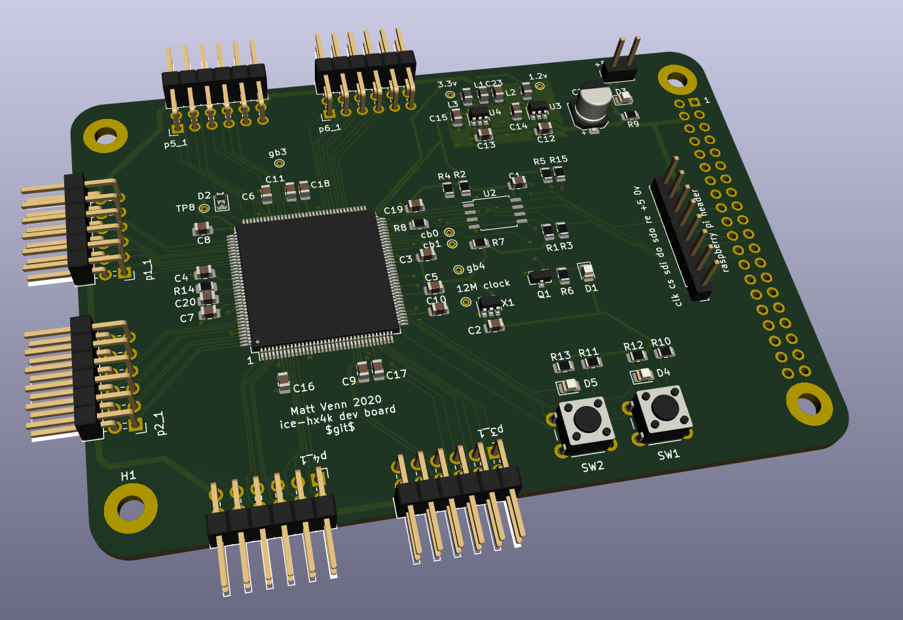

# Aim

* Make my first PCB with an FPGA
* Keep it super simple and cheap
* Configured by on-board FLASH or direct with a Raspberry Pi

# What a Lattice iCE40 FPGA needs

* A clock input. Has to be provided by an oscillator, it doesn't have a crystal driver.
* 1.2v core supply for the internal logic.
* 2.5v non volatile memory supply. Can be provided via a voltage drop over a diode from 3.3v.
* IO supply for the IO pins, different banks of IO can have different supplies. This design uses 3.3v for all banks.
* Get configured over SPI interface. This can be done directly by a microcontroller or a computer, or the bitstream can be programmed into some FLASH, and the FPGA will read it at boot. If FLASH isn't provided then the bitstream needs to be programmed at every power up or configuration reset. 
* Decoupling capacitors for each IO bank.

# PCB

* [Schematic](hardware/schematic.pdf)
* [OHSPark project](https://oshpark.com/shared_projects/KnMD4ql8) or [Gerbers](hardware/first-fpga-pcb-2020-01-01-fab.zip)
* Cheap, 2 layer board. Probably not so good for fast signals.

# BOM

* FPGA iCE40-HX4K-TQ144 (8k accessible with Icestorm tools)
* 3.3v reg TLV73333PDBVT
* 1.2v reg TLV73312PDBVT
* 12MHz oscillator SIT2001BI-S2-33E-12.000000G
* 16MB FLASH IS25LP016D-JBLE (optional).

# Test

See the [test program](test/top.v). This flashes LED2, and LED1 is connected to SW1.

    make prog

Yosys and NextPNR are used to create the bitstream and then it's copied to the Raspberry Pi specified
by PI_ADDR in the [Makefile](test/Makefile). 

[Fomu-Flash](https://github.com/mattvenn/fomu-flash) is used for programming. Fomu-Flash should be able
to reconfigure the pins used with -g, but I couldn't get this to work, so I hard-coded the right pins in my
fork.

# HW V1: d9c7cdf

## Errata

* didn't expose a 2nd CS pin so can't communicate with SPI without removing flash 

# HW V2: 444ba78

* removed a few unnecessary pullups on SPI lines
* connect 4 general purpose pins between Pi & FPGA
* connect an additional CS pin for SPI comms with Pi
* breakout all Pi pins on separate pins
* shrink board in y axis slightly for even holes and to fit larger Pi boards
* added some optional pullup resistors to allow an I2C connection between Pi & FPGA, broken out on pmod p3
* used FOMU programming pins so default FOMU programming app will work

# Inspiration

* https://github.com/OLIMEX/iCE40HX1K-EVB/blob/master/iCE40HX1K-EVB_Rev_B.pdf
* https://github.com/icebreaker-fpga/icebreaker/blob/master/hardware/v1.0e/icebreaker-sch.pdf
* icestick

# Reference

* Family datasheet: http://www.latticesemi.com/view_document?document_id=49312
* Programming/FLASH spec: http://www.latticesemi.com/view_document?document_id=46502
* Pinout: http://www.latticesemi.com/view_document?document_id=49383
