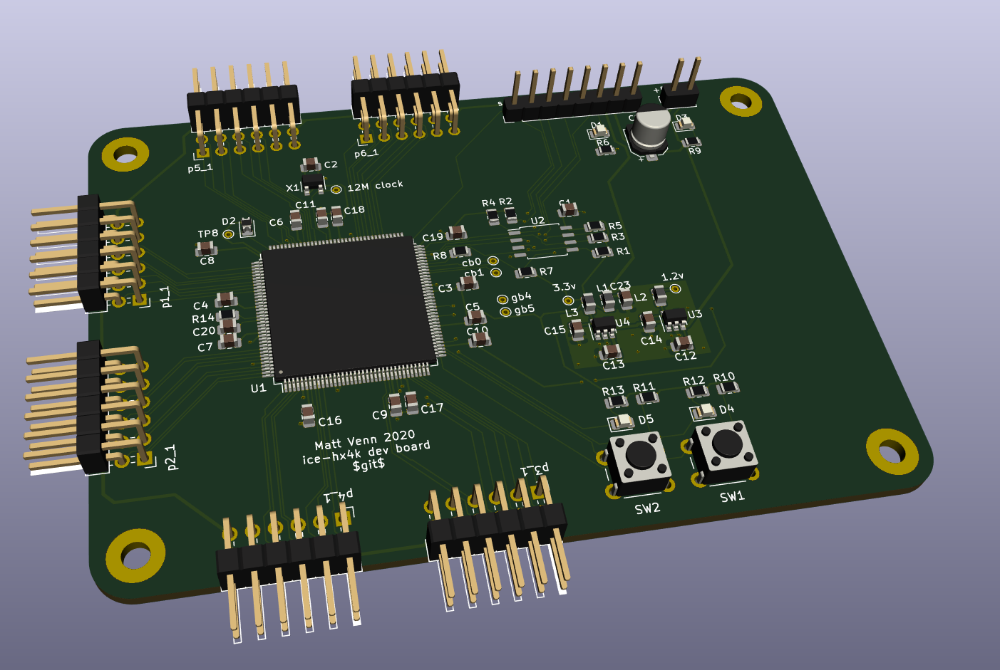

# Aim

* make my first PCB with FPGA
* keep it super simple and cheap
* program FLASH or direct with a Raspberry Pi

# BOM

* FPGA iCE40-HX4K-TQ144
* 3.3v reg TLV73333PDBVT
* 1.2v reg TLV73312PDBVT
* 12MHz oscillator SIT2001BI-S2-33E-12.000000G
* 16MB FLASH IS25LP016D-JBLE

# Questions

*

# Todo

## Schematic

* add pi programming header

## Layout

* add pi programming header

# Inspiration

* https://github.com/OLIMEX/iCE40HX1K-EVB/blob/master/iCE40HX1K-EVB_Rev_B.pdf
* https://github.com/icebreaker-fpga/icebreaker/blob/master/hardware/v1.0e/icebreaker-sch.pdf
* icestick

# Reference

* Family datasheet: http://www.latticesemi.com/view_document?document_id=49312
* Programming/FLASH spec: http://www.latticesemi.com/view_document?document_id=46502
* Pinout: http://www.latticesemi.com/view_document?document_id=49383
